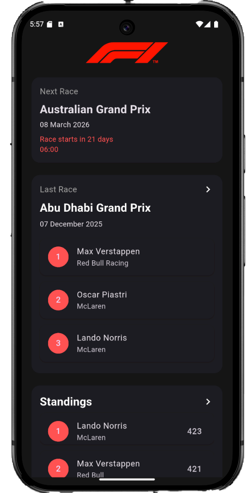

# Flutter-F1-App

Full-stack Formula 1 dashboard: a Flutter frontend that consumes a FastAPI backend with Redis caching to show upcoming race details, last race results, and championship standings.

## Features

- Next race card with local time conversion
- Last race top 3 results
- Driver and constructor standings (top 3 preview + full list)
- API caching with TTL until race finish
- Global rate limiting on all endpoints

## Screenshot



Add your screenshot at `docs/screenshot.png` (any PNG works).

## Project structure

- `frontend/`: Flutter app
- `backend/data_collection/`: FastAPI service + data collection
- `docker-compose.yaml`: local backend + Redis

## Architecture overview

- Flutter app calls REST endpoints from `ApiService`
- FastAPI endpoints load data using `fastf1`/Ergast and cache responses in Redis
- Cache TTL is calculated to expire after the next race finishes

## API endpoints

- `GET /last_race/standings` -> last race top 3 drivers
- `GET /last_race/data` -> last race metadata
- `GET /next_race/data` -> next race metadata
- `GET /championship/standings` -> driver standings
- `GET /championship/constructors/standings` -> constructor standings

All endpoints are rate limited to 60 requests per 60 seconds per IP.

## Local setup

### Backend (Docker)

From the repo root:

```bash
docker compose up --build
```

The API will be available at `http://localhost:8000` and Redis at `localhost:6379`.

### Backend (local Python)

```bash
cd backend/data_collection
python -m venv .venv
.venv/Scripts/activate
pip install -r requirements.txt
set REDIS_URL=redis://localhost:6379
uvicorn endpoints:app --reload --host 0.0.0.0 --port 8000
```

### Frontend (Flutter)

```bash
cd frontend
flutter pub get
flutter run
```

To build web output:

```bash
flutter build web --release
```

## Configure API base URL

The Flutter app uses a hardcoded API base URL in `frontend/lib/services/api_service.dart`. For local development, change it to:

```
http://localhost:8000
```

## Deployment

### Backend (Render)

1. Create a new Web Service from the `backend/data_collection` folder.
2. Set the start command:

```bash
gunicorn endpoints:app --workers 1 --worker-class uvicorn.workers.UvicornWorker --bind 0.0.0.0:8000 --timeout 120
```

3. Add a Redis instance and set `REDIS_URL` in the backend service env vars.
4. Enable HTTP on port 8000.

### Frontend (static hosting)

1. Build the web bundle:

```bash
cd frontend
flutter build web --release
```

2. Deploy the contents of `frontend/build/web` to a static host (Netlify, Vercel, GitHub Pages, or Render Static Site).
3. Ensure the Flutter app points to your deployed backend URL in `frontend/lib/services/api_service.dart`.

## Tech stack

- Flutter + Dart
- FastAPI + Uvicorn/Gunicorn
- Redis caching + rate limiting
- fastf1/Ergast data sources

## Notes

- Race times are converted to local time in the Flutter client.
- Cache TTL is computed in the backend based on the next race start time.